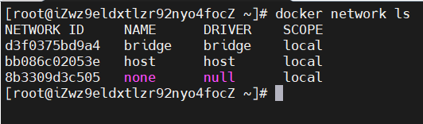
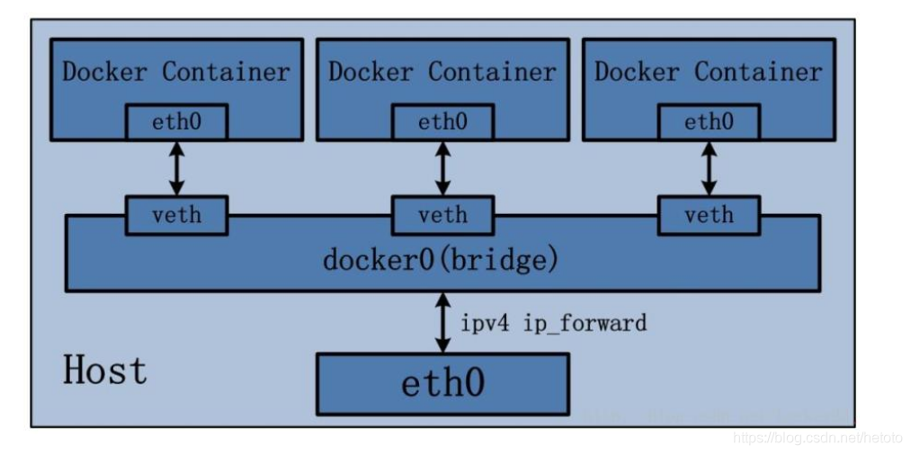

# Docker 网络

安装 docker 时，它会自动创建三个网络：bridge（创建容器默认连接到此网络）、 none 、host。  
使用`docker network ls`可查看  

网络模式|描述
--|:--:
Bridge|为每一个容器创建 Network NameSpace，分配 IP 等，并将容器通过一对 veth pair 连接到一个 docker0 虚拟网桥，通过 docker0 网桥以及 NAT 实现与宿主机通信|
Host|容器不会创建 Network NameSpace，容器和宿主机共享 Network NameSpace|
None|容器有独立的 Network NameSpace，但并没有对其进行任何网络设置，如分配 veth pair 和网桥连接，配置IP等。|
Container|多个容器共享同一套 Network NameSpace|
自定义网络|略|

## Bridge
Bridge 模式下容器没有公有 ip，只有宿主机可以直接访问容器，容器无法访问直接外部主机，需要通过宿主机的 NAT 规则后可以直接访问外网。  
  
Bridge 桥接模式的实现步骤主要如下：  
* Docker Daemon 利用 veth pair 技术，在宿主机上创建两个虚拟网络接口设备，假设为 veth0 和 veth1。而
veth pair 技术的特性可以保证无论哪一个 veth 接收到网络报文，都会将报文传输给另一方。
* Docker Daemon 将 veth0 附加到 Docker Daemon 创建的 docker0
网桥上。保证宿主机的网络报文可以发往 veth0；
* Docker Daemon 将 veth1 添加到 Docker Container 所属的 namespace 下，并被改名为
eth0。如此一来，保证宿主机的网络报文若发往 veth0，则立即会被 eth0 接收，实现宿主机到 Docker Container 网络的联通性；同时，
也保证 Docker Container 单独使用 eth0，实现容器网络环境的隔离性

## Host
Docker 不会为容器创建独有的 Network NameSpace 而是使用宿主机的 Network NameSpace，和宿主机共享网络环境。
表现为容器和宿主机的 IP 一致，Host 最大的优势就是网络性能比较好，但是宿主机上已经使用的端口就不能再用了，网络的隔离性不好。

## None
不为容器配置任何网络功能。

## Container
这个模式指定新创建的容器和已经存在的一个容器共享一个 Network Namespace，而不是和宿主机共享。新创建的容器不会创建自己的网卡，配置自己的 IP，
而是和一个指定的容器共享 IP、端口范围等。同样，两个容器除了网络方面，其他的如文件系统、进程列表等还是隔离的。两个容器的进程可以通过 lo 网卡设备通信。
